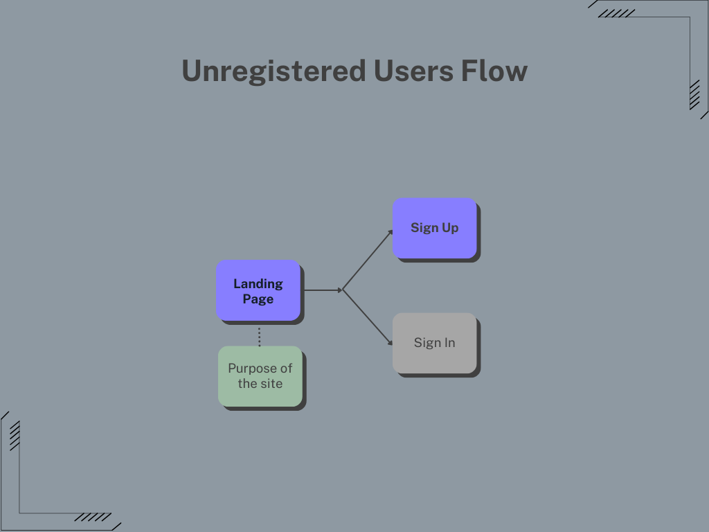
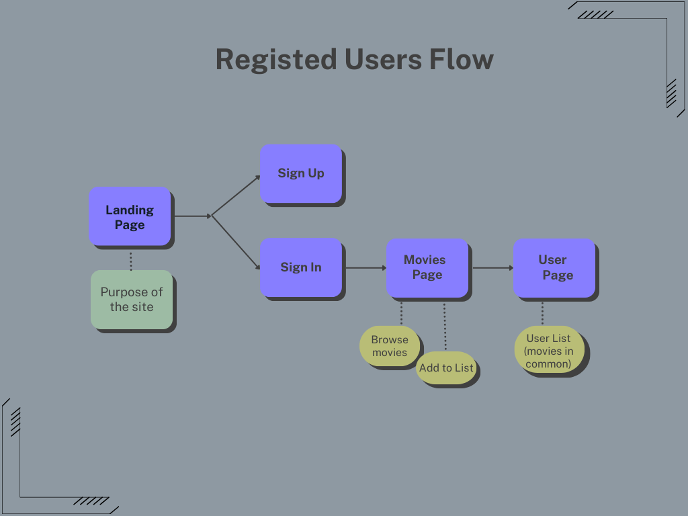

  
# MOVIE MATCHER

 

[💻Live Site]()

# **Index**

- [MOVIE MATCHER](#movie-matcher)
- [**Index**](#index)
- [**Concept**](#concept)
- [**UX**](#ux)
- [**User Stories**](#user-stories)
  - [**Users**](#users)
  - [**Registered User**](#registered-user)
- [**Features**](#features)
  - [**Features to Implement in Future**](#features-to-implement-in-future)
- [**Flowcharts**](#flowcharts)
  - [**User Unregister**](#user-unregister)
  - [**User Registered**](#user-registered)
- [**Database Squema - Elephant SQL**](#database-squema---elephant-sql)
- [**Agile Methodology**](#agile-methodology)
- [**Design**](#design)
- [**Technologies Used**](#technologies-used)
  - [Languages](#languages)
  - [Frameworks and Libraries](#frameworks-and-libraries)
  - [Database Host](#database-host)
  - [Deployment Host](#deployment-host)
  - [Other Resources](#other-resources)
- [**Validation**](#validation)
- [**Testing**](#testing)
- [**Team**](#team)
  

# **Concept**
 
The project had been planned to be a tool that reduce the time of the users to find a movie to watch when with a friend that is user as well. Each user would have a list of saved movies and when seeing the friend's page, they would see display the ones in common. 

NOTE: 
This readme contains the user stories and flowchart of the initial plan, at this stage most of the main features had been left for future implementation. This is down to communication issues by the backend team, as they being the 50% of the team, couldn't continue with the project but we, frontend team, were informed with short notice to the due line, so we tried to adapt for to deliver it, but was too short time for be able to research and implement the MVP. So at this point the project is mainly frontend with Clerk implemented for authentication, there was research for implement the API for movies but at the moment of this note it's still not working 100%.

# **UX**
 
In order to follow the tendency we had research in different streaming sites and services, and from this we had decide to follow the dark theme that is commonly used on them.

# **User Stories**
 

## **Users**

 
As User I want to be able to visualize and navigate through the sections of the app
   
   - Navbar 
   - Footer

As Unregistered User I want to see the purpose of the site when landing in it
   - Landing page with clear reference to objective of the app

As User I want to contact the staff if I require help or clarification of a process
   - Contact Form link in Footer

As Unregistered User, I want to be able to register so that I can create my account and access to the registered user features
   - Link for Sign Up in Navbar

## **Registered User**
 

As Registered User I want to access to my account with the saved information on it
   - User Page

As Registered User I want to search for a friend and see the movies they have saved.
   - Users search bar
   - Users Profiles

# **Features**
 
The list and screenshot about them can be found   

[here]()

 

## **Features to Implement in Future**
 
As  the time frame was affected by external factors out of our control, some of the 'could have' features had been left for future implementation.
Howsoever fields and some of the need elements for them had been set in place since the beginning, and are there for when can be done.
Some of them are:

# **Flowcharts**
 
Had been divided in two as for type of users.

## **User Unregister**
 

## **User Registered**
 

# **Database Squema - Elephant SQL**
 
For the data base had been used Mongo, and the diagram is as below.

 

# **Agile Methodology**
 
For keep track of the Agile method I had used Project Board on GitHub.

[Project Board](https://github.com/chingu-voyages/v45-tier3-team-41/projects?query=is%3Aopen).

# **Design**
 

The wireframes can be found [here](readme_files/docs/wireframes.md)

# **Technologies Used**
 

## Languages

- [HTML](https://html.com/)

- [CSS](https://www.w3.org/Style/CSS/)

- [React](https://react.dev/)

## Frameworks and Libraries

- [Tailwind](https://tailwindcss.com/)
  
- [Next.js](https://nextjs.org/)
  
- [Shadcn](https://ui.shadcn.com/)
  

## Database Host

- [MONGO]()  

## Deployment Host

## Other Resources

- [GitHub](https://github.com/)

# **Validation**
The validation reports can be found ETC

# **Testing**

# **Team**

The team sub-divided in two teams and a guide:

Frontend:
- Josué Mbuyu    [GitHub](https://github.com/josuembuyu) 
- Ivette Mc Dermott  [GitHub](https://github.com/IvetteMcDermott) 

Backend:
- Natasha Buckham    [GitHub](https://github.com/natashabuckham)
- Bushra Fatima      [GitHub](https://github.com/aspiringsoftwareprogrammer)

Guide:
- Kumbirai    [GitHub](https://github.com/asideofcode-dev)
